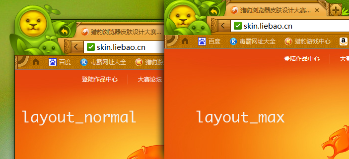
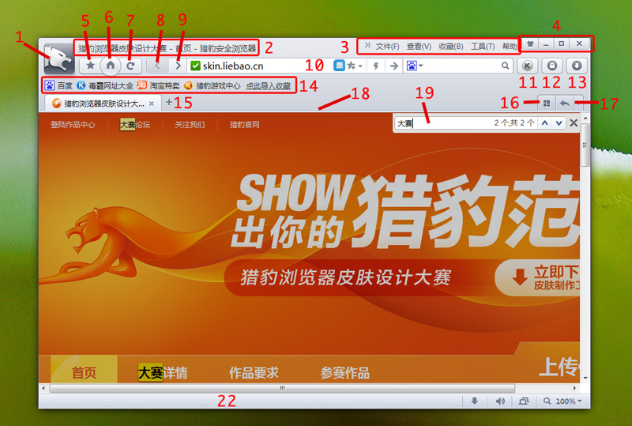

.. include:: ../LINKS.rst

.. _chapterLBlayoutMain:

猎豹 layout_main 详解
==============================================================================

什么是 layout_main 文件
------------------------------------------------------------------------------

在猎豹浏览器的皮肤文件中，一共有三个配置文件，分别是：图片显示文件（manifest.json）、图片定位文件（layout_main）、图片参数文件（layout_parameter）。
其中 layout_main 主要记录的是浏览器在最大化、标准化状态时，各个控制部分的位置。

view 的 id 元素列表
~~~~~~~~~~~~~~~~~~~~~~~~~~~~~~~~~~~~~~~~~~~~~~~~~~~~~~~~~~~~~~~~~~~~~~~~~~~~~~

猎豹浏览器的皮肤配置项有两种布局方式，`layout_normal`和`layout_max`。其中`layout_normal`为猎豹浏览器在非最大化状态时的布局模式，`layout_max`则为猎豹浏览器在最大化状态时的布局模式。我们可以通过这两种不同的配置来控制猎豹浏览器在最大化和非最大化的状态。在此我们使用绿野仙踪来举例。

.. _layout_normal_max:

在猎豹浏览器的 layout_main 皮肤布局文件中，每一个功能按钮都是使用 `view` 标签表示的，例如控制主页按钮的代码为 `<view id="icon_btn" width="60" relative="left_top" delta="10 0"/>`。

.. _layout_normal_all:

.. list-table:: view 元素列表
   :widths: 5 25 10
   :header-rows: 1

   * - 标号
     - manifest.json 参数
     - 说明
   * - 1
     - 头像按钮
     - icon_btn
   * - 2
     - 页面标题
     - title_bar
   * - 3
     - 浏览器菜单栏
     - mainmenu_bar
   * - 4
     - 系统控制条（最大化，最小化，关闭）
     - syscmd_bar
   * - 5
     - 收藏按钮
     - fav_menu_btn
   * - 6
     - 回到主页按钮
     - home_btn
   * - 7
     - 重新加载按钮
     - reload_btn
   * - 8
     - 返回按钮
     - back_btn
   * - 9
     - 向前按钮
     - forward_btn
   * - 10
     - 地址栏&搜索栏
     - tool_bar
   * - 11
     - 安全按钮
     - safe_btn
   * - 12
     - 登陆账号管理按钮
     - login_magr_btn
   * - 13
     - 下载管理按钮
     - download_btn
   * - 14
     - 书签栏
     - bookmark_bar
   * - 15
     - 标签页栏
     - tab_bar
   * - 16
     - 多标签预览
     - multi_tab_btn
   * - 17
     - “恢复上一个打开的页面”按钮
     - undo_btn
   * - 18
     - 主界面与网页之间的分割线
     - tab_separator
   * - 19
     - 页面搜索栏
     - find_bar
   * - 20
     - 信息栏
     - info_bar
   * - 21
     - 标签内容
     - tab_content
   * - 22
     - 状态栏
     - status_bar

view 标签参数详解
~~~~~~~~~~~~~~~~~~~~~~~~~~~~~~~~~~~~~~~~~~~~~~~~~~~~~~~~~~~~~~~~~~~~

以此代码为例：`<view id="icon_btn" width="60" relative="left_top" delta="9 9"/>`

.. _LBLM-id:

- id
  - 描述：
      指定此元素的名称，例如 `icon_btn` 为浏览器的头像按钮，`title_bar` 为浏览器的菜单栏。

.. _LBLM-width:

- width
  - 描述：
      指定此元素的宽度，参数值为数字，单位默认为像素即 `px` 。例如，设置元素的宽度为80px：`width="80"`。

.. _LBLM-height:

- height
  - 描述：
      指定此元素的高度，参数值为数字，单位默认为像素即 `px` 。例如，设置元素的高度为80px：`height="80"`。

.. _LBLM-relative:

- relative
  - 描述：
      指定此元素的定位标准，可选参数值有四个：`left_top`（以左上角为标准）、`left_bottom`（以左下角为标准）、`right_top`（以右上角为标准）和`right_bottom`（以右下角为标准）。一般配合下面的 `delta` 数值使用。
      

.. _LBLM-delta:

- delta
  - 描述：
      指定此元素的的偏移量，由上一条的 `relative` 决定。有两个数值，分别对应两个位置的距离。例如 `relative="left-top" delta="10 9"` 为此元素以预留空间的右上角为坐标原点，元素的左上角距离坐标原点x轴10px，y轴9px的位置。
      .. _layout_normal_all:
      .. figure:: ../_static/themes/layout_main_all.jpg

.. _LBLM-proportion:

- proportion
  - 描述：
      指定此元素的縮放比例，参考对象是图片的原始大小，属性值为数值，代表百分比。例如，缩放为原始图片的90%可以写成 `proportion="90"`。
      

.. _LBLM-margin:

- margin
  - 描述：
      指定此元素的外边距大小，与 `delta` 类似，其属性值分别对应为此元素的 左，上，右，下 四个边距的大小。如果参数值为四个以下的数字，则从左到右依次表示。例如 `margin: 10 2 4 8` 表示此元素的左边距为 10px，上边距为 2px，右边距为 4px，下边距为 8px；如果为 `margin: 10 2`，则表示左边距为 10px，上边距为 2px，其余的边距保持默认值 0px；依次类推，如果为一个数值，或者三个数值都是类似描述。
      

demo: clasc's layout_main
^^^^^^^^^^^^^^^^^^^^^^^^^^^^^^^^^^^^^^^^^^^^^^^^^^^^^^^^^^^^^^^^^^^^^

.. code-block:: xml
  :emphasize-lines: 2-5,219,246-253

    <?xml version="1.0" encoding="UTF-8"?>
    <layout>
    <layout_normal>
      <list>
        <list id="control_area">
            <list direction="horizontal">
            <view id="icon_btn" width="60" relative="left_top" delta="9 9"/>
            <list proportion="100">
                <list direction="horizontal">
                  <view id="title_bar" preferred_size="fixed_height" height="29" margin="0 0 0 -3" proportion="100"/>
                  <view id="mainmenu_bar"/>
                  <view id="syscmd_bar"/>
                </list>
                <list direction="horizontal" relative="left_bottom" delta="0 2">
                    <view id="fav_menu_btn" margin="5 0 -18"/>
                    <view id="home_btn"/>
                    <view id="reload_btn" margin="-18"/>
                    <list direction="horizontal" align="vertical" proportion="100">
                      <padding width="6"/>
                      <view id="back_btn" margin="0 6"/>
                      <view id="forward_btn" margin="0 6"/>
                      <view id="tool_bar" preferred_size="fixed_height" height="30" proportion="100"/>
                      <list direction="horizontal">
                        <padding width="4"/>
                        <view id="safe_btn" margin="0 6"/>
                        <padding width="4"/>
                        <view id="login_magr_btn" margin="0 6"/>
                        <padding width="4"/>
                        <view id="download_btn" />
                        <padding width="4"/>
                      </list>
                    </list>
              </list>
            </list>        
            </list>
            <view id="bookmark_bar" margin="5 -6"/>
            <list direction="horizontal">
                <view id="tab_bar" margin="10 2" proportion="100"/>
          <view id="multi_tab_btn" margin="0 2 -2" preferred_size="fixed_height" width="27"/>
          <view id="undo_btn" margin="0 2 11" preferred_size="fixed_height" height="27"/>
            </list>
            <view id="tab_separator" margin="0 -2" preferred_size="fixed" height="4" proportion="100"/>
        </list>
        <list id="content_area" proportion="100">
          <view id="find_bar"/>
          <view id="info_bar"/>
          <view id="tab_content" proportion="100"/>   
        </list>
        <view id="status_bar"/>
      </list>
    </layout_normal>
    <layout_max>
      <list>
        <list id="control_area">
            <list direction="horizontal">
            <view id="icon_btn" width="60" relative="left_top" delta="10 9"/>
            <list proportion="100">
                <list direction="horizontal">
                  <view id="title_bar" margin="0 0 0 -3" preferred_size="fixed_height" height="29" proportion="100"/>
                  <view id="mainmenu_bar"/>
                  <view id="syscmd_bar"/>
                </list>
                <list direction="horizontal" relative="left_bottom" delta="0 2">
                    <view id="fav_menu_btn" margin="5 0 -18"/>
                    <view id="home_btn"/>
                    <view id="reload_btn" margin="-18"/>
            <list direction="horizontal" align="vertical" proportion="100">
              <padding width="6"/>
              <view id="back_btn" margin="0 6"/>
              <view id="forward_btn" margin="0 6"/>
              <view id="tool_bar" preferred_size="fixed_height" height="30" proportion="100"/>
              <list direction="horizontal">
                <padding width="4"/>
                <view id="safe_btn" margin="0 6"/>
                <padding width="4"/>
                <view id="login_magr_btn" margin="0 6"/>
                <padding width="4"/>
                <view id="download_btn" />
                <padding width="4"/>
              </list>
            </list>
              </list>
            </list>        
            </list>
            <view id="bookmark_bar" margin="5 -6"/>
            <list direction="horizontal">
                <view id="tab_bar" margin="10 2" proportion="100"/>
          <view id="multi_tab_btn" margin="0 2 -2" preferred_size="fixed_height" width="27"/>
          <view id="undo_btn" margin="0 2 11" preferred_size="fixed_height" height="27"/>
            </list>
            <view id="tab_separator" margin="0 -2" preferred_size="fixed" height="4" proportion="100"/>
        </list>
        <list id="content_area" proportion="100">
          <view id="find_bar"/>
          <view id="info_bar"/>
          <view id="tab_content" proportion="100"/>
        </list>
        <view id="status_bar"/>
      </list>
    </layout_max>
    <layout_full>
      <list>
        <list id="control_area">
          <view id="title_bar" preferred_size="fixed"/>
          <view id="icon_btn" preferred_size="fixed"/>
          <view id="undo_btn" preferred_size="fixed"/>
          <view id="tab_bar" preferred_size="fixed"/>
          <view id="syscmd_bar" preferred_size="fixed"/>
          <view id="bookmark_bar" preferred_size="fixed"/>
          <view id="tab_separator" preferred_size="fixed"/>
        </list>
        <list id="content_area" proportion="100">
          <view id="find_bar"/>
          <view id="info_bar"/>
          <view id="tab_content" proportion="100"/>
        </list>
      </list>
    </layout_full>
    </layout>