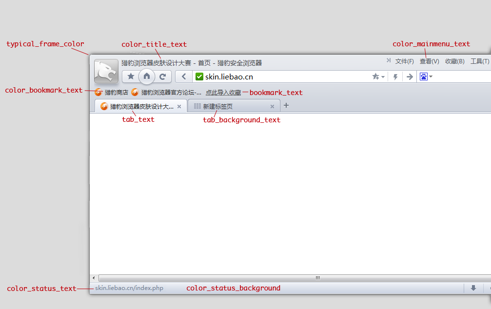
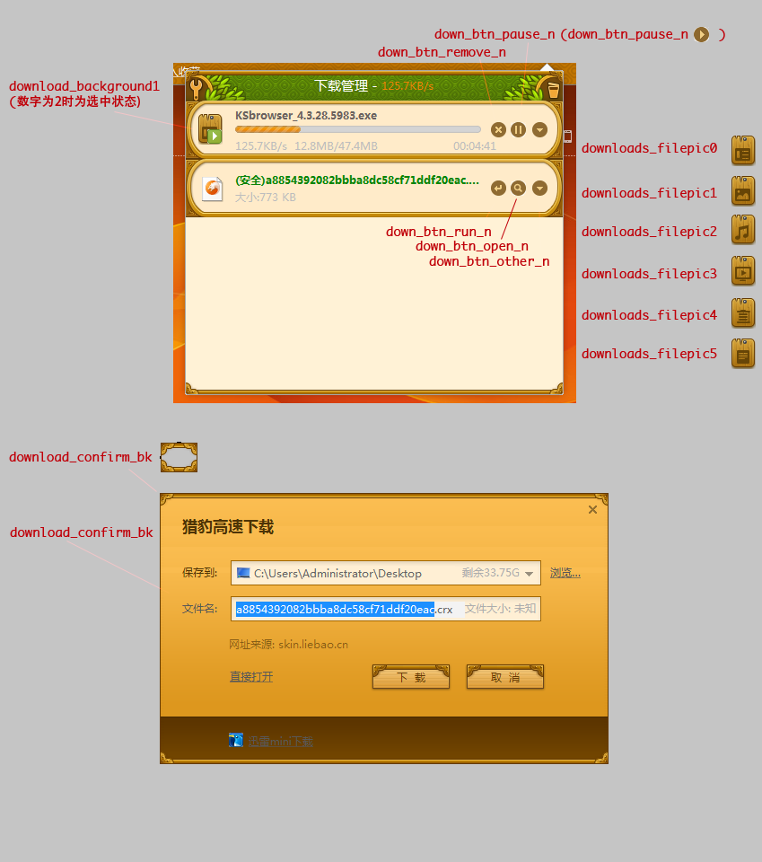

.. include:: ../LINKS.rst

.. _chapter5TCG:

猎豹皮肤关键参数定制说明 
==============================================================================

官方文档中指出主题皮肤创建中要上 `*.cc` 代码中翻找相关信息,对于纯粹的设计人员而言,太囧!
所以,需要一份清晰的手册,指引设计人员快速完成主题皮肤的设计.

所以,有了当前这份:ThemesCreationGuide ~ 主题主题皮肤创建手册!

相关工具的配合
---------------------------------------------------------------------

.. _fig_5_t_1:

.. _fig_5_t_2:

    主题皮肤可定制元素索引

参考以上图片,标出了所有可以进行定制的主题皮肤元素,
我们将使用以上数字逐一说明怎样定制对应UI!

- 首先,创立以主题皮肤名为目录名的空白目录作工程容器.
- 然后,创建两样东西:
  + 将创建的图片(png格式)收集在 `images` 目录
  + 创建最重要的 :ref:`manifest.json <chapter3-manifest>` 清单文件, 这是主题皮肤扩展要求必须有的文件!

    - 使用普通的文本编辑器即可进行编辑
    - 注意,文件名必须全小写

- 最后,就可以进行打包测试了.

在 Chrome 中有很多东西可以主题皮肤化,详细的参考下文 "主题皮肤元素描述" 一节.

主题皮肤可定制元素
---------------------------------------------------------------------

颜色元素 Color Elements
^^^^^^^^^^^^^^^^^^^^^^^^^^^^^^^^^^^^^^^^^^^^^^^^^^^^^^^^^^^^^^^^^^^^^

颜色元素被定义在manifes.json文件的“colors”块。

颜色使用的是RGB数值，有些元素可以包含透明度值，比如："ntp_section": [15, 15, 15, 0.6]

.. list-table:: 颜色元素
   :widths: 5 25 10
   :header-rows: 1

   * - 标号
     - 说明
     - manifest.json 参数
   * - 1.1
     - 当前选中标签的文字颜色
     - :ref:`"tab_text" <LBMF-tab_text>`
   * - 1.2
     - 未选中标签的文字颜色
     - :ref:`"tab_background_text" <LBMF-tab_background_text>`
   * - 2.1
     - some define
     - :ref:`"typical_frame_color" <LBMF-typical_frame_color>`
   * - 2.2
     - some define
     - :ref:`"typical_frame_color_inactive" <LBMF-typical_frame_color_inactive>`
   * - 3.1
     - 普通状态时的收藏栏文字的颜色
     - :ref:`"color_bookmark_text" <LBMF-color_bookmark_text>`
   * - 3.2
     - 鼠标浮动状态时的收藏栏文字的颜色
     - :ref:`"color_bookmark_hov_text" <LBMF-color_bookmark_hov_text>`
   * - 3.3
     - 当鼠标按下时的收藏栏文字的颜色
     - :ref:`"color_bookmark_high_text" <LBMF-color_bookmark_high_text>`
   * - 3.4
     - 普通状态时状态栏的文字颜色
     - :ref:`"color_status_text" <LBMF-color_status_text>`
   * - 4
     - 状态栏的背景颜色
     - :ref:`"color_status_background" <LBMF-color_status_background>`
   * - 5.1
     - 普通状态时的“点击导入收藏”链接的文字颜色
     - :ref:`"bookmark_text" <LBMF-bookmark_text>`
   * - 5.2
     - 鼠标按下状态时的“点击导入收藏”链接的文字颜色
     - :ref:`"bookmark_press_link" <LBMF-bookmark_press_link>`
   * - 6
     - 地址栏输入下拉栏中高亮关键字的颜色
     - :ref:`"color_locationbar_resulturl_texthighlight" <LBMF-color_locationbar_resulturl_texthighlight>`
   * - 7
     - some define
     - :ref:`"color_user_login_link_text" <LBMF-color_user_login_link_text>`
   * - 8.1
     - 普通态时通用按钮的文字颜色
     - :ref:`"color_button_text_n" <LBMF-color_button_text_n>`
   * - 8.2
     - 鼠标 hover 时通用按钮的文字颜色
     - :ref:`"color_button_text_h" <LBMF-color_button_text_h>`
   * - 8.3
     - 鼠标按下时通用按钮的文字颜色
     - :ref:`"color_button_text_p" <LBMF-color_button_text_p>`
   * - 8.4
     - 禁止按下时通用按钮的文字颜色
     - :ref:`"color_button_text_d" <LBMF-color_button_text_d>`
   * - 9
     - 浏览器菜单栏的文字颜色
     - :ref:`"color_mainmenu_text" <LBMF-color_mainmenu_text>`
   * - 10
     - 网页标题文字的颜色
     - :ref:`"color_title_text" <LBMF-color_title_text>`
   * - 11
     - 标签在地址栏下方时，状态栏的文字颜色
     - :ref:`"status_bar_text_color" <LBMF-status_bar_text_color>`
   * - 12
     - 登陆账号成功后，头像菜单中用户名称的文字颜色
     - :ref:`"color_menu_title_user_name" <LBMF-color_menu_title_user_name>`
   * - 13
     - 登陆账号成功后，显示的相关信息字体的颜色
     - :ref:`"color_menu_title_description" <LBMF-color_menu_title_description>`
   * - 14
     - 处于离线状态时，“重新连接”文字的颜色
     - :ref:`"color_menu_title_text_prompt" <LBMF-color_menu_title_text_prompt>`

图片 Image Elements
^^^^^^^^^^^^^^^^^^^^^^^^^^^^^^^^^^^^^^^^^^^^^^^^^^^^^^^^^^^^^^^^^^^^^

图片元素在 :ref:`manifest.json <chapter3-manifest>` 中 `images` 一节定义

.. list-table:: 图片元素
   :widths: 5 25 10 10
   :header-rows: 1

   * - 标号
     - 说明
     - manifest.json 参数
     - 建议尺寸(宽x高)
   * - 1
     - 顶部,Chrome 标签背景区域
     - :ref:`"theme_frame" <TCG-theme_frame>`
     - ∞ x 80
   * - 1.1
     - 区域同上,仅在不活跌时生效
     - :ref:`"theme_frame_inactive" <TCG-theme_frame_inactive>`
     - ~
   * - 1.2
     - 区域同上,但在"匿名模式"下窗口激活时生效
     - :ref:`"theme_frame_incognito" <TCG-theme_frame_incognito>`
     - ~
   * - 1.3
     - 区域同上,但在"匿名模式"下窗口不活跃时生效
     - :ref:`"theme_frame_incognito_inactive" <TCG-theme_frame_incognito_inactive>`
     - ~
   * - 2
     - 包含当前标签同工具栏一起的表现
     - :ref:`"theme_toolbar" <TCG-theme_toolbar>`
     - ∞ x 120
   * - 3
     - 覆盖所有未激活标签区域
     - :ref:`"theme_tab_background" <TCG-theme_tab_background>`
     - ∞ x 65
   * - 3.1
     - 区域同上,但浏览器在"匿名模式"下
     - :ref:`"theme_tab_background_incognito" <TCG-theme_tab_background_incognito>`
     - ~
   * - 4
     - 标签背景,可以容纳各种事务*(规划中)
     - :ref:`"theme_tab_background_v" <TCG-theme_tab_background_v>`
     - ~
   * - 5
     - 是主题样式的最大背景
     - :ref:`"theme_ntp_background" <TCG-theme_ntp_background>`
     - 最小也应是: 800x600
   * - 6
     - 在frame 左侧顶层显示的图片
     - :ref:`"theme_frame_overlay" <TCG-theme_frame_overlay>`
     - 110 x 40
   * - 6.1
     - 区域同前,仅在窗口不活跃时生效
     - :ref:`"theme_frame_overlay_inactive" <TCG-theme_frame_overlay_inactive>`
     - ~
   * - 7
     - 标签工具栏按钮背景
     - :ref:`"theme_button_background" <TCG-theme_button_background>`
     - 30 x 30
   * - 8
     - 此图片将显示在"theme created by" 一节
     - :ref:`"theme_ntp_attribution" <TCG-theme_ntp_attribution>`
     - ~
   * - 9
     - 窗口控制按钮背景(关闭,最小,,,)
     - :ref:`"theme_window_control_background" <TCG-theme_window_control_background>`
     - ~

着色元素 Tint Elements
^^^^^^^^^^^^^^^^^^^^^^^^^^^^^^^^^^^^^^^^^^^^^^^^^^^^^^^^^^^^^^^^^^^^^

着色元素改变图片的色调，饱和度和亮度

着色元素在manifest.json文件的tints块下

.. list-table:: 色调元素
   :widths: 5 25 10
   :header-rows: 1

   * - 17
     - 可应用于chrome中各种按钮
     - :ref:`"buttons" <TCG-buttons>`
   * - 18
     - 应用于chrome的框架
     - :ref:`"frame" <TCG-frame>`
   * - 18.1
     - 应用于未激活的chrome窗口
     - :ref:`"frame_inactive" <TCG-frame_inactive>`
   * - 18.2
     - 应用于隐身模式的框架
     - :ref:`"frame_incognito" <TCG-frame_incognito>`
   * - 18.3
     - 同上，未激活时
     - :ref:`"frame_incognito_inactive" <TCG-frame_incognito_inactive>`
   * - 19
     - 未激活的标签
     - :ref:`"background_tab" <TCG-background_tab>`

UI属性元素 UI Property Elements
^^^^^^^^^^^^^^^^^^^^^^^^^^^^^^^^^^^^^^^^^^^^^^^^^^^^^^^^^^^^^^^^^^^^^

属性元素在manifest.json文件的properties块

.. list-table:: UI界面属性
   :widths: 5 25 10
   :header-rows: 1

   * - 20
     - 内部背景图片的对齐方式
     - :ref:`"background_tab" <TCG-ntp_background_alignment>`
   * - 21
     - 上面的背景是否要重复
     - :ref:`"ntp_background_repeat" <TCG-ntp_background_repeat>`
   * - 22
     - 选择google的logo？
     - :ref:`"ntp_logo_alternate" <TCG-ntp_logo_alternate>`

主题皮肤元素描述 Description of Elements
--------------------------------------------------------------------------------------------

这些是基础元素，仅仅使用它们，你可以快速地创建一个主题

Basic Theme Elements
^^^^^^^^^^^^^^^^^^^^^^^^^^^^^^^^^^^^^^^^^^^^^^^^^^^^^^^^^^^^^^^^^^^^^

只对首页可定制图元的配置项进行必要说明! 详细的,可以给出链接到专门的章节条目!!!

.. _TCG-theme_frame:

- theme_frame:

  - 这是一个图像，这个图像表示在标签后面的区域。对于这个图像没有很严格的尺寸限制，没有被覆盖掉的地方将由颜色元素frame覆盖。这个图像默认是延X轴重复的。记住，这个图像不会延Y轴重复。所以要保证它足够高，能盖住工具栏区域，大于80像素很不错，通常在底部使用渐变透明，这样图片就能和frame颜色融合了。（你也可以制作一个大尺寸的图片，延伸并且覆盖掉frame边框）。 否则，你将会在窗口处于恢复模式时，看到有一个小分割在框架的最左上角。  或者，你可以制作一个很宽宽宽宽宽的图像，宽到看不到图像重复。但是由于图像的分辨率太大，会减慢主题的加载速度。要注意的是，如果你不改变这个图像，默认的chrome框架会显示出来，那个蓝色的，frame颜色元素不会覆盖掉这个。
  - 详细 :ref:`theme_frame <LBMF-theme_frame>`

.. _TCG-theme_toolbar:

- theme_toolbar:
  - 这是一个图像，覆盖当前标签和在它下面的工具栏。
一定要保证这个图像的高大于119PX，因为查找栏（ctrl+f）也使用这个图像。宽度你可以自己决定。和theme_frame一样，它也是延X轴重复的。记住，工具栏包括一些按钮和书签栏。
所以不要设计得太拥挤，否则工具栏不会好看。对于工具栏，一个正方形的平铺图像是首选，可能仅仅是一个渐变或者单色。

.. _TCG-theme_tab_background:

- theme_tab_background:
  - 所有未激活状态的标签图
通常是一个比theme_toolbar饱和度低的图像。你也可以设计其它的，但是要确保设计能使用户分得清哪些是未激活的，哪个是激活的。这个同样是延x轴平铺的，高度大概是65px，宽度随便。

.. _TCG-theme_ntp_background:

- theme_ntp_background:
  - 这个图像显示在浏览器的新标签的大的白色区域，这块白色区域包括一个有alpha透明度的背景图片（默认的页面包含有许多快速进入的元素）。记住，ntp标记表示new tab page（新标签页），因此，在标记中包含ntp表示一些在新标签页中的元素。
有两种方式来制作内部背景。一个是使用没有重复和平铺的大图，或者是用小图通过x轴和（或）Y轴重复。(详情请看 ntp_background_repeat)
你还可以为这个图片选择一个对齐方式。默认是居中对齐。 (详情请看 alpha transparency)

高级主题元素 Advanced Theme Elements
^^^^^^^^^^^^^^^^^^^^^^^^^^^^^^^^^^^^^^^^^^^^^^^^^^^^^^^^^^^^^^^^^^^^^^^^^^^^^^

使用一下的属性来制作更高级的主题。

.. _TCG-theme_frame_inactive:

- theme_frame_inactive:
  - 这个图片表示当chrome失去焦点或者未激活时，在标签后面的区域。
所有使用于theme_frame的，都是使用于这个。通常为了避免使主题太大，你可以看看着色部分的frame_inactive，这样比制作一个新图像更有效率。但是这还是由你来决定

.. _TCG-theme_frame_incognito:

- theme_frame_incognito:
  - 这个和theme_frame是一样的，但是这个图像表示窗口在隐身模式下的框架。你可以重新为隐身模式设计一个图像。

.. _TCG-theme_frame_incognito_inactive:

- theme_frame_incognito_inactive:
  - 同上，未激活的情况下。(详情请看 frame_incognito_inactive)

.. _TCG-theme_tab_background_incognito:

- theme_tab_background_incognito:
  - 这个是在隐身模式下的未激活标签的图像。你可以使用着色部分的background_tab来渲染隐身模式下的未激活标签。但是有一个小问题有些人可能想避免。即使你着色了未激活标签，他们被默认为透明，因此，他们将会显示他们后面的区域，比如，框架。如果你想避免这个，你可以包括这个图像。

.. _TCG-theme_tab_background_v:

- theme_tab_background_v:
  - Until now, the role of this image is amystery, that someone needs to unlock!

.. _TCG-theme_frame_overlay:

- theme_frame_overlay:
  - 这个图像会显示在框架的右上角，在theme_frame图像上。而且，这个图像默认不会重复。因此，这个图像可以用于你不想让框架区域重复的情况下。和theme_frame一样，任何高于80px的都不错。

.. _TCG-theme_frame_overlay_inactive:

- theme_frame_overlay_inactive:
  - 这个和theme_frame_overlay是一样的。但是这个会在窗口未激活状态下显示。如果不包括这个图像，theme_frame_overlay会被颜色加深后使用。

.. _TCG-theme_button_background:

- theme_button_background:
  - 这个图像是用来区分工具栏各种按钮（停止，刷新，后退和前进等）。这个图像是可选的，如果你不包含这个图像，颜色元素button_background会覆盖按钮的背景颜色。
不论你用什么图像，浏览器会在顶部和桌面留下2像素，并且在底部映射一个25px的图像作为背景。而且按钮的图标会居中显示。

.. _TCG-theme_ntp_attribution:

- theme_ntp_attribution:
  - 这个图像用来显示右下角的作者。Chrome会自动加上“Theme created by”标题。
一个好的做法是，制作一个小的png文件写上作者名字（和联系方式，如果必要）。大图像会使主题变大。

.. _TCG-theme_window_control_background:

- theme_window_control_background:
  - 这个图像用来区分窗口控制按钮（最小化，最大化，关闭和新标签）。这个图也不是必须的除非你十分希望改变控制按钮的背景。如果这个图像被包含，浏览器会在顶部和桌面留下1px并且映射一个16px高的按钮，宽度根据按钮改变。
如果这个图像没有被包括，控制按钮会被在颜色元素button_background中定义。

高级主题元素（二）：颜色元素
^^^^^^^^^^^^^^^^^^^^^^^^^^^^^^^^^^^^^^^^^^^^^^^^^^^^^^^^^^^^^^^^^^^^^^^^^^^^^^

.. _TCG-Frame:

- Frame:
  - 这是一个颜色元素，为指定浏览器框架区域的颜色（标签页后的区域+边框）。它是 :ref:`"theme_frame" <TCG-theme_frame>` 图片没有覆盖到的区域，在 manifest.json 文件中用来指定这个元素的格式是 `"frame" : [R,G,B]` 。

.. _TCG-Frame_inactive:

- Frame_inactive:
  - 这是一个颜色元素，指定浏览器中非活动窗口或者失去焦点窗口的边框区域（标签页的背景+边框）。它使用的是 :ref:`"theme_frame" <TCG-theme_frame>` 图片没有覆盖到的区域，在 manifest.json 文件中用来指定这个元素的格式是 `"frame_inactive" : [R,G,B]` 。

.. _TCG-Frame_incognito:

- Frame_incognito:
  - 此颜色属性和 :ref:`"frame" <TCG-theme_frame>` 类似，但是属于隐身模式。

.. _TCG-Frame_incognito_inactive:

- Frame_incognito_inactive:
  - 同上，但是是在窗口未激活状态下生效。

.. _TCG-toolbar:

- toolbar:
  - 这是一个颜色元素，用来定义书签栏的背景颜色。它包含一个边框，这个边框的颜色在ntp_header中定义。这个元素可以定义透明度。注意，透明度数字是一个从0到1的浮点数。数值越低，透明度越高。格式为: "toolbar": [R,G,B,opacity]注意，这个元素也定义了浮动状态栏的背景（在页面的下面）。使用透明度会使状态栏透明，但是在里面的文字会包含一个同颜色的不透明的背景。因此，不包含文字的区域会透明。

.. _TCG-tab_text:

- tab_text:
  - 这个颜色元素定义了当前标签的标题文字颜色。

.. _TCG-tab_background_text:

- tab_background_text:
  - 这个颜色定义了未激活/失焦的标签的颜色。

.. _TCG-bookmark_text:

- bookmark_text:
  - 这个颜色元素定义了在工具栏的书签和出现在下面的下载栏的文字颜色。注意：在下载过程中，已经下载的MB数的颜色时不可以定义的。 

.. _TCG-ntp_background:

- ntp_background:
  - 这个颜色标签定义了新标签页的背景颜色（覆盖所有没有被theme_ntp_background覆盖的区域）。通常如果一个alpha透明度在theme_ntp_background被使用的话，请确定ntp_background和它相配。

.. _TCG-ntp_text:

- ntp_text:
  - 这个颜色元素定义了所有出现在新标签页的文字颜色。（小提示，快速连接标签等）。

.. _TCG-ntp_link:

- ntp_link:
  - 这个颜色元素定义了所有出现在新标签页的连接颜色。

.. _TCG-ntp_link_underline:

- ntp_link_underline:
  - 这个颜色元素定义了所有连接的下划线颜色（ntp_link的下划线颜色）。

.. _TCG-ntp_header:

- ntp_header:
  - 这个颜色元素定义了快速连接按钮的框架颜色，当你用鼠标经过它时。他也定义了toolbar元素，ntp_section元素的1px边框颜色和3个在新标签页的小按钮——缩略图查看，列表查看，改变页面图层。

.. _TCG-ntp_section:

- ntp_section:
  - 这个原色元素定义了快速连接按钮边框的颜色和最近关闭栏的背景颜色。可以包括透明值。

.. _TCG-ntp_section_text:

- ntp_section_text:
  - 这个颜色元素定义了所有section区域的文字颜色。

.. _TCG-ntp_section_link:

- ntp_section_link:
  - 这个颜色元素定义了所有的出现在section区域的连接颜色。

.. _TCG-ntp_section_link_underline:

- ntp_section_link_underline:
  - 这个颜色元素定义了所有连接下划线的颜色（ntp_section_link的下划线）。

.. _TCG-control_background:

- control_background:
  - 这应该为控制按钮的窗口最小化、最大化和关闭来指定颜色。但是我不能确认，它好像是用以下元素来覆盖。

.. _TCG-button_background:

- button_background:
  - 这个颜色元素定义了所有的工具栏区域的按钮的背景颜色（后退，前进，书签等等）。这个元素也可以定义透明值，这个会影响到窗口控制按钮（最小化，最大化，关闭）。

高级主题元素（三）：着色元素
^^^^^^^^^^^^^^^^^^^^^^^^^^^^^^^^^^^^^^^^^^^^^^^^^^^^^^^^^^^^^^^^^^^^^^^^^^^^^^

下面是着色元素。着色元素button是最普遍的一个，但是你也可以用其它的元素。在前进到这些元素之前，你应该知道着色怎么工作。着色元素被用来分配颜色色彩给某个浏览器区域上的元素。色彩的值是一个从0到1的浮点数。比如，"buttons" : [0.3,0.5,0.5]（及时是0.125或者0.65也是一种颜色）。

第一个数字表示色调值。

第二个数字表示饱和度值。0表示不饱和，1表示完全饱和。

第三个数字表示亮度值。0表示最不亮，1表示最亮。

.. _TCG-buttons:

- buttons:
  - 这个着色元素用来定义所有工具栏的按钮图标。

.. _TCG-frame:

- frame:
  - 这个着色元素用来定义框架区域的着色。所有你为框架区域制作的图会被这个着色。

.. _TCG-frame_inactive:

- frame_inactive:
  - 同上，但是是在窗口没有激活状态下生效。

.. _TCG-frame_incognito:

- frame_incognito:
  - 这个同frame，但是是在隐身模式下。

.. _TCG-frame_incognito_inactive:

- frame_incognito_inactive:
  - 同上，但是是在窗口未激活状态下生效。

.. _TCG-background_tab:

- background_tab:
  - 这个着色元素用来定义在隐身模式下未激活的标签。

高级主题元素（四）：属性元素
^^^^^^^^^^^^^^^^^^^^^^^^^^^^^^^^^^^^^^^^^^^^^^^^^^^^^^^^^^^^^^^^^^^^^

.. _TCG-ntp_background_alignment:

- ntp_background_alignment:
  - 这个属性元素用来控制图像元素theme_ntp_background的对齐方式属性。格式如下："ntp_background_alignment" :"VALUE"。
VALUE部分你可以输入“top”，“bottom”，“left”或者使用组合“left top”，“right bottom”等等。比如："ntp_background_alignment" :"left bottom"（默认是center）。

.. _TCG-ntp_background_repeat:

- ntp_background_repeat:
  - 这个属性元素是用来控制theme_ntp_background图像元素的重复的。格式为："ntp_background_repeat" :"VALUE"。
VALUE部分可以输入"repeat","no-repeat","repeat-x"或者"repeat-y"。

.. _TCG-ntp_logo_alternate:

- ntp_logo_alternate:
  - 这个属性元素定义了你主题的chrome标志。格式如下："ntp_logo_alternate" : VALUE
注意到这个VALUE不能输入引号！只有0和1。0会在新标签页给你一个色彩丰富的logo，1会给你一个全白的logo。

Packaging
^^^^^^^^^^^^^^^^^^^^^^^^^^^^^^^^^^^^^^^^^^^^^^^^^^^^^^^^^^^^^^^^^^^^^

.. seealso:: (^.^)
    
    原文: `Theme Creation Guide <https://code.google.com/p/chromium/wiki/ThemeCreationGuide>`_
